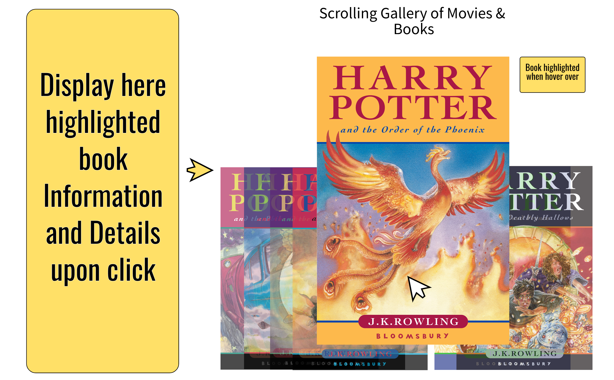
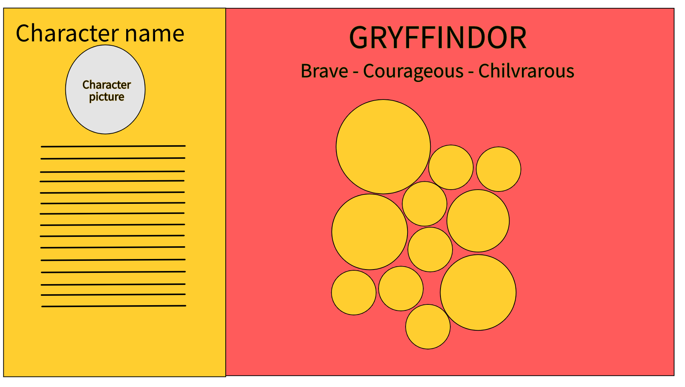
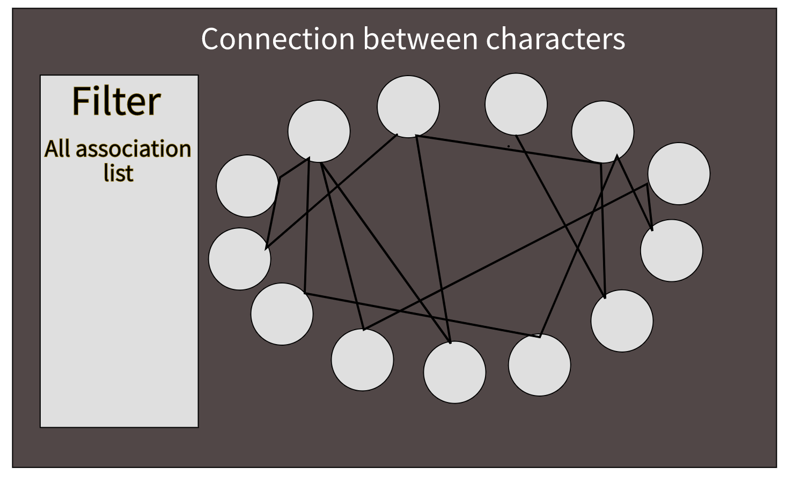
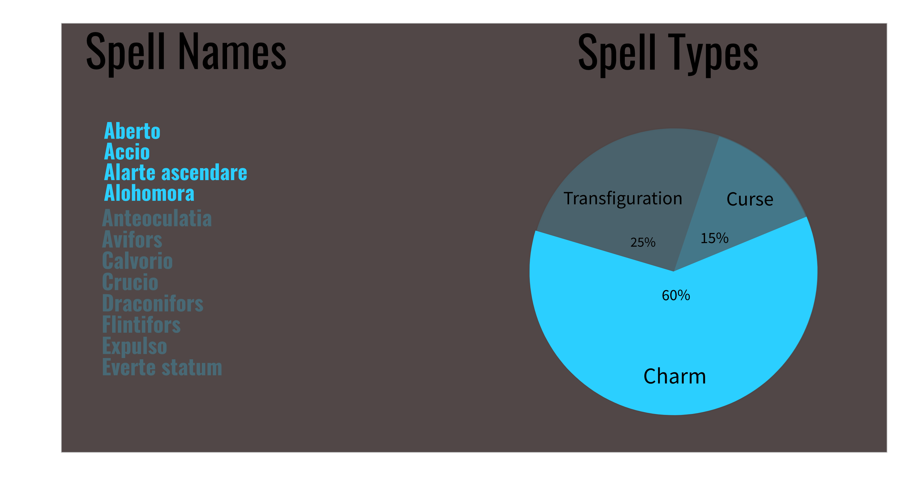
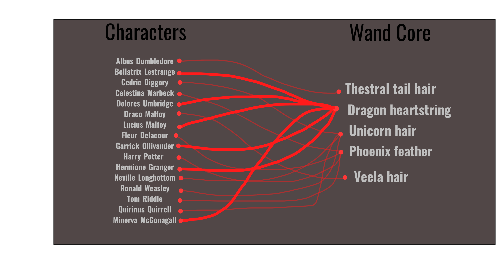
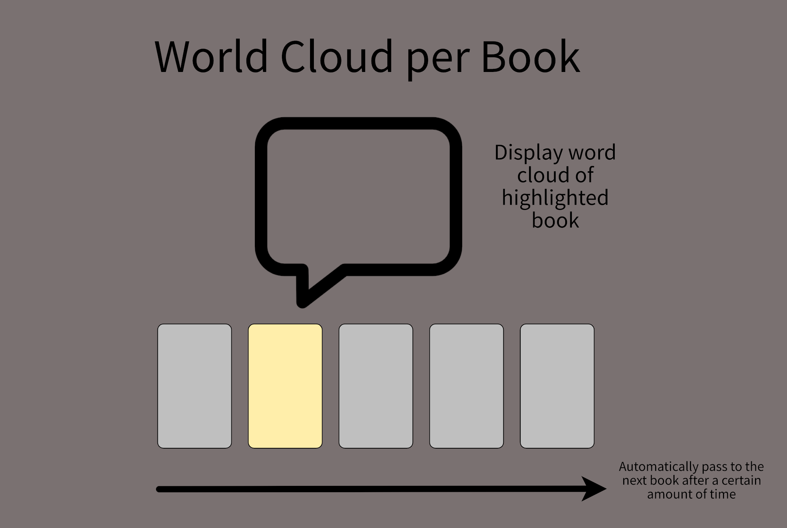

## Milestone 2

Authors: Alessio Verardo, Emna Fendri, Stephane Selim

---

We will present the different visualisations we'd like to show in our project and what information we want to convey in each of them, along with some sketches to have a rough view of what the final product will look like. 

## General structure and comments
We will need the following 2 lectures throughout the whole projects, therefore we will only mention them once and not under each visualisation.

 - The web development and D3 lectures as the visualisation is the central goal of the project.
 - The lecture on storytelling, since it will be important to understand how to write the story in a interesting and interactive way.

More generally, we will use `fullpage.js` to provide a good experience for the user. We will also use `Boostrap` as the CSS library since it provides easy-to-use built-in components.

Our core website will be composed of the following visualisations:

### Introduction
Our page will start with a quick introduction into the Harry Potter universe with a:
- Logo: The iconic Harry Potter logo
- Description: of the story and the universe
- Interesting numbers: like number of books, franchise turnover, number of languages the books have been translated into, etc.
### Books & Movies 
<figure>
    </img>
</figure>

In this section we want to display information about each movie and book of the Harry Potter universe. We thought of displaying this info in the context of a scrolling gallery. For each set (movies or books), we display a gallery of the items, and highlight the item whenever the mouse hovers over one. Upon click of an item, we display the relevant information on a pane on the side.

> We could make use of a fisheye distortion effect using D3 to highlight a book in a scrolling gallery whenever we hover over it, but this still under consideration.

### Hogwarts houses
</img>
Hogwarts houses is a very central subject as well as the entry point of the student in the Wizarding world. Each student will be sorted into one of the 4 Hogwarts houses when (s)he starts his/her scholarship. Since a lot of new students are sorted each year in the different houses, it can be hard to keep track of who belongs to which house. The aim of this visualisation is precisely to help the reader to explore interactively the different houses. We will start with a “menu” section (not shown here) which will simply allow the user to click on one of the 4 houses (s)he wants to investigate. 

The second part of the visualisation will be more challenging but also more complete and interesting, it will display the different character in the selected house. Each character will be represented by a circle. When we click on a character, a side information bar will appear with all the character related information. Moreover, the size of the circle describing the character will depend on the importance of the character throughout the book series, i.e. the size will depend on the number of book each character appears. 

> We will need to use the Bubble Diagram features from D3 (for the second part of the visualisation),  the “menu” can be done using vanilla Javascript and we will need the lectures on D3 and Javascript. 

### Character networks
</img>
After the investigation of the houses, we may want to get more insights about the characters. For this purpose, we will provide a graph exploration tool. The goal is to investigate the most known associations or groups of people in the Harry Potter series. The tool will provide a filtering by association feature and will enable dynamic exploration of the network (via zooming and panning). Additionally, all the informations we have about one character will be displayable. 

> For ths visualisation, we will probably need the lecture on graphs as well as a mix of Javascript, D3 and sigmajs libraries .

### Spells
</img>

We have at our disposal a complete dataset collecting a lot of spells that can be cast by Harry Potter world wizards. We collected a significant amount of spells, that we sort into six categories.
In this visualisation, we represent on the right-hand side of the page a pie chart showing the percentage of spell types. On the left-hand side, we list the corresponding spell names according to their category. 

### Wands
</img>

Each wand consists of a type of wood surrounding a core of magical substance. The wood may be unique to each wand, but the core material is generally redundant (there are 4 of them). In this visualisation, we will display through a Sankey chart a mapping between the 15 main characters of the saga and the core material of their wand.

### Word Cloud
</img>

We'd like to display the most prominent words that occur throughout the collection of Harry Potter books through the use of word clouds. We would have the book covers displayed and whenever we hover (or click) on one, it would interactively update the corresponding word cloud. We could also have it updated automatically to pass to the next book after a certain time to see the progression of the world cloud. We would also have an option of displaying the word cloud for all the books together.

### Additional visualisations
If we have time, we will try to do more advanced visualisations such as 
- **Spells launched by line** in the book. More concretely, this visualisation will allow the user to explore at which time each spell is launched and in which context. For this visualisation, will probably only `d3` and more precisely `d3-brush` to allow more interaction for the user.
- Sentiment analysis in movie screenplay. This visualisation will probably be the most advanced one as it will involve some Machine Learning to be able to extract emotion and sentiment for each line said by characters. THis visualisation will allow us to navigate across the movies and scenes in each movie and to see how the emotion of a character evolves across this scene and maybe across the whole movie. For this visualisation, we will probably only need diverse features from the `d3` library. 

